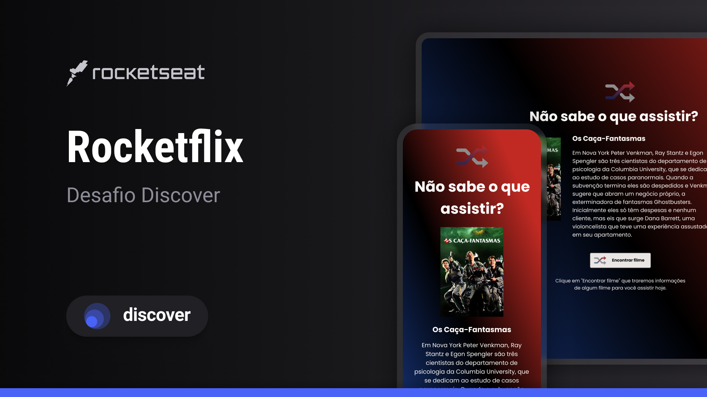

<h1 align="center"> Rocketflix </h1>

Desafio promovido pela plataforma Rocketseat(discover)

  

## 🚀 Tecnologias

Esse projeto foi desenvolvido com as seguintes tecnologias:

- ReactJs
- JavaScript
- Git e Github

## 💻 Projeto

Neste desafio foi utilizado a API do themoviedb.org para exibir um filme aleatório sempre que clicar em Encontrar Filme.

## 🔖 Layout

Você pode visualizar o layout do projeto através [DESSE LINK](https://www.figma.com/community/file/1241111569594636891). É necessário ter conta no [Figma](https://figma.com) para acessá-lo.

## :memo: Licença

Esse projeto está sob a licença MIT.